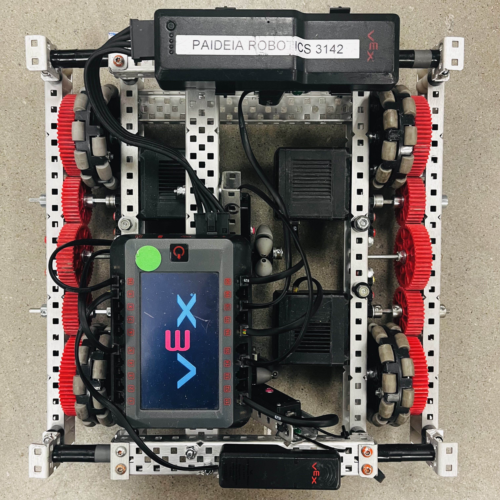

# Personal Project
I am working on a robot just for learning more about odometry and building. 

The screen.cpp and screen.hpp headers I made a while back were meant to not be tied to my code, and are generalized. I find them extremely useful, and feel free to use them! I don't think I'll be adding any screen documentation besides the existing Doxygen comments.

This also uses [MVLib](https://github.com/lewispinstein-hue/MotionView/tree/main/MVLib), another library I developed for use with [MotionView](https://github.com/lewispinstein-hue/MotionView/tree/main). As I develop MotionView more and more, this is where I go to test it. 

Here is an image of the robot:

